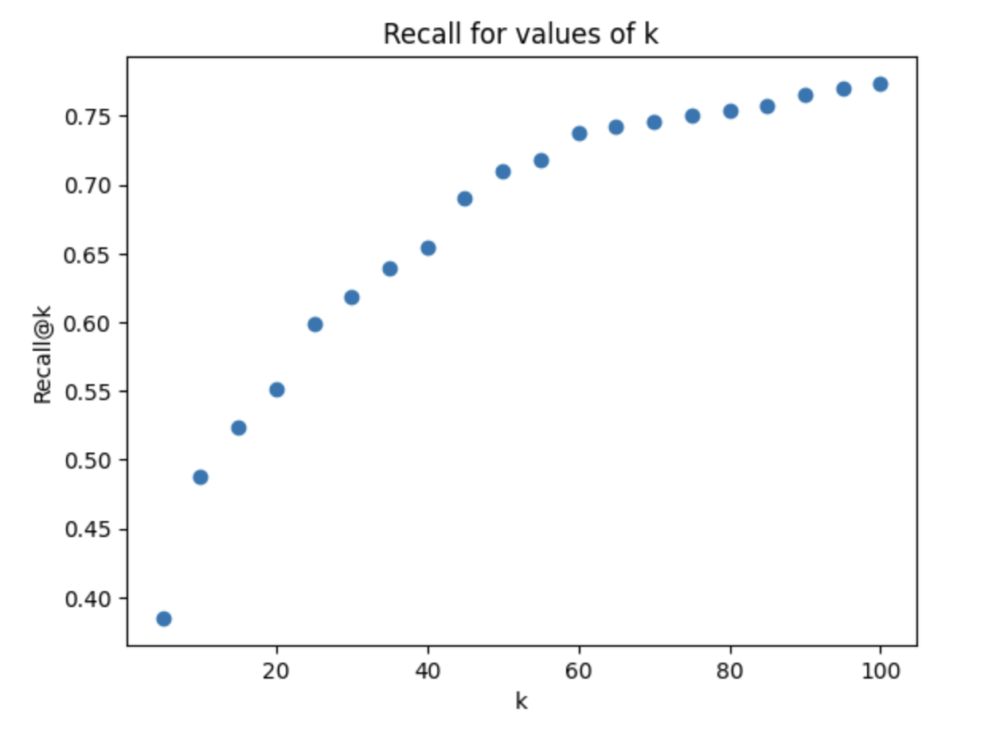
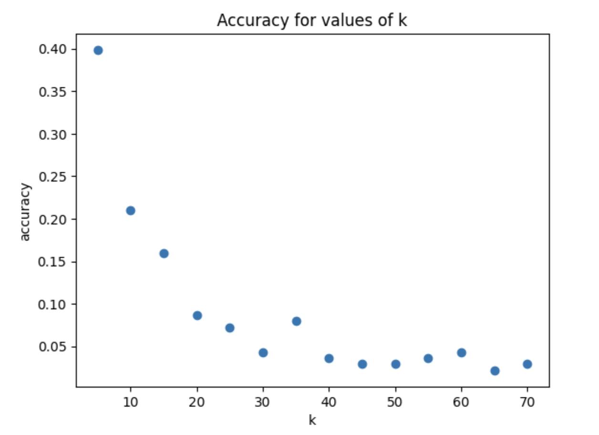

# ConvFinQA

## Introduction
The task is based on the [ConvFinQA dataset](https://github.com/czyssrs/ConvFinQA). 
The requirement is to answer users' questions about financial data using the `train.json` data. 
One option would be to treat this problem as a standard Retrieval-Augmented Generation (RAG) problem, where the 
documents are put into a vector store, and at query time the relevant documents are retrieved from the store and the
required answer is extracted from one or more of those documents. However, the main requirement here appears to be to extract
information from a relatively-structured dataset, in the form of HTML tables, possibly performing some
additional operations, such as determing the difference between values in different columns, calculating percentages, etc.
This suggests that a much more structured approach might be appropriate. 

The approach taken here is to
focus on the data stored in the HTML tables and treat the task as a Table QA problem.
This requires creating a structured database that can be used to answer users' questions. Syntactically-correct
SQL DDL and DML statements are generated by an LLM to allow a SQL database to be created from the HTML tables.
An LLM is then used to generate a SQL query based on a user's natural-language question. These SQL generation
tasks are well-suited to LLMs. 

## Requirements

- Python 3 (only tested on 3.13)
- [poetry](https://python-poetry.org/) to manage dependencies ([installation](https://python-poetry.org/docs/#installation)) 
- OpenAI API access (key should be insertted)

## Installation

1. Install dependencies: `poetry install --no-root`
2. Copy `.env_sample` to `.env`
3. Set `OPEN_API_KEY` in `.env`
4. Create the vector store. The vector store is used to identify the set of candidate tables which might be able to answer a user's question.
```
    $ poetry run python -m tomoro.ingest

```
5. Create the sqlite database that is used to answer user queries. There is a python program `tomoro/generate_sql_db.py` which can be used to create
the sqlite DB, but this is quite time-consuming, so a gzipped version is included in this repository which can be unpacked as follows:
```
    $ gunzip convfinqa.sqlite.gz
```

## Operation

There is a FastAPI-based REST service which is used to generate answers to user's questions. To start this service:
```
    $ poetry run uvicorn tomoro.server:app
```

The service can be queried over http, e.g. using curl:
```
    $ curl -H "Content-Type: application/json" -X POST -d '{"question": "what is the maximum variance during the quarter ended in september 31 , 2005?"}' http://localhost:8000/query/
```

## Evaluation

The details of these evaluations are in the [notebooks](/notebooks) directory.

### Evaluation of Candidate Tables Retrieval

#### Overview
In order to answer a user's question, we need to accurately identify which table contains the relevant information. The first stage is to identify a set of candidate tables, based on the information in the table and the question. There is a parameter 'k' which determines how many tables are returned in the candidate set. Although recall will obviously improve with higher values of k, we typically want this first stage to identify a small candidate set, as a larger candidate set will result in a more expensive, less precise subsequent call to the LLM when we try to filter the candidate set down to a single table.

#### Metrics
Recall@k (R@k): we need to determine the recall for different values of k (which will inform the runtime choice of a suitable value for k). Note that if a system parameter like the value of k is chosen using data that will also be used to test the system as a whole, this invalidates that evaluation to some extent. In reality, a different dataset should be used to select a value for k.

#### Conclusion
The results below clearly indicate diminishing returns for values of k ~ 60 and higher. Although it's impossible to properly identify a suitable value for k without understanding the downstream implications on cost and statistical accuracy, this does set an upper bound on the value of k.




### Evaluation of Table Selection

#### Overview
Once the system has selected a candidate set of tables for answering a user's question, we need to identify the most likely single table which should be selected in order to the answer the user's query. This is evaluted by determining the frequency with which the correct table is selected, from a candidate set which includes the expected answer.

#### Metrics
Here we are interested in the frequency with which the system selects the correct answer from candidate sets of different sizes, given that the candidate set contains the correct answer. As this is a simple right/wrong scenario, we just measure accuracy as the proportion of correct answers given. In the evaluation of the candidate table retrieval, we noted that for larger values of k, we see diminishing returns in recall, so here we cap the evaluation at k=70.

#### Conclusion
As expected, as the size of the candidate set of tables increases, we see diminishing accuracy as there are more options to choose from. The selection of the correct table is very challenging; there are many tables which, to a human analyst, would appear relevant to a given question, so although the baseline human performance is not known, it is likely to be substantially below 100%. The results shown below are relatively poor, but the algorithm does at least perform about twice as well as random selection (~40% accuracy with 5 candidates, ~20% with 10 candidates), so there is a base signal that can be iterated and improved upon.



### Evaluation of Overall Performance

#### Overview
This is the evaluation of the complete system i.e. sending a natural-language question about some financial data to the system, and for the system to determine the correct answer based on the dataset it has been given.

#### Metrics
The evaluation is a relatively simple determination of accuracy: does the system give the correct answer or not? In the evaluation, there is some leeway granted to the system's response, given that the expected answers often include additional symbols ('%' for percentages, currency symbols for monetary amounts, etc). We have also tried to account for errors introduced by rounding, by assessing a response to be correct if the expected value and actual answer differ by a small amount. It is possible that this introduces some error in the evaluation process.

#### Conclusions
The accuracy of the system was determined to be around 15%. This is low, but not surprising given the difficulty of the task and the lack of time for refinement and tuning of the system.